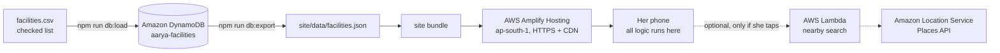

# Aarya

**A private, lightweight guide to urgent sexual health care and rights, for sex workers and survivors of sexual violence in Bengaluru.**

**Live:** https://main.d1fxtl99crgtan.amplifyapp.com

Built solo for **First Commit**, the first event of the WeMakeDevs × AWS **Bharat Builds Tour** (17–20 September 2026).

> **Aarya is not a medical service and does not diagnose.** It routes people to care. All medical and legal text is drafted from public guidelines and is **awaiting clinical and legal review**. In an emergency, call **112**.

---

## The problem

Some of the most important care after unprotected or forced sex only works if it starts quickly. Medicine that can prevent HIV (PEP) has to be started within 72 hours. Emergency contraception works better the sooner it is taken.

The people who most need that care are often the least likely to reach it in time:

- **Sex workers** report fearing being seen at health facilities, and verbal abuse and discrimination from health workers ([Frontiers in Public Health, 2022, Maharashtra](https://www.frontiersin.org/journals/public-health/articles/10.3389/fpubh.2022.1030914/full)).
- Women who hide their work from health workers use preventive services less ([BMC Public Health, 2019, Brazil](https://pmc.ncbi.nlm.nih.gov/articles/PMC6399834/)). Staying silent does not remove the barrier.
- **Survivors of sexual violence** are legally entitled to free treatment at any hospital (BNSS 2023, Section 397), yet a 2024 Delhi High Court case recorded a survivor who could not get it without repeated intervention by the legal services authority ([SCC Times](https://www.scconline.com/blog/post/2025/01/03/delhi-hc-issues-specific-directions-provision-free-medical-treatment-rape-acid-attack-pocso-victims-survivors-hospitals-public-private/)).
- Community and peer support is associated with more women seeking STI treatment at government facilities ([Andhra Pradesh study](https://pmc.ncbi.nlm.nih.gov/articles/PMC4003583/)). This is why Aarya has a mode for the helpers who already reach these women.

Survivors are also often too shocked, or too afraid of being judged, to explain what happened out loud at a hospital desk or a police station. Staff then ask the same painful questions again and again.

**Aarya answers four questions, privately and in plain language: what should I do now, where can I get it, what are my rights, and how do I tell someone without having to say it?**

---

## What it does

1. **Emergency first.** A "Call 112" button is the first thing on the home screen. Helplines (112, 108, 181, 1097, 14416) are in the footer of every screen.
2. **A short form, not a chatbot.** She ticks what happened, when, how her body is now, and anything else that applies (under 18, thoughts of self-harm, can't reach a hospital today). She can also type in her own words.
3. **A personalised "What to do now" list, most urgent first.** It is built by fixed, testable rules, never generated by AI. For example: forced sex in the last 3 days leads to PEP, then emergency contraception, then "If you can't get to a hospital right now", then infection care, then complaint options, then support.
4. **Notes to show someone, so she doesn't have to say it.** She answers a few more multiple-choice questions and Aarya turns them into two short notes in her own voice, written as "I" sentences, that she can hand over on the phone:
   - **For the doctor:** anything urgent first (choking, head injury, possible drugging), then what happened, what she has done since (washed, changed clothes), her body now, what the doctor needs for medicines (last period, birth control, allergies), and what she needs, such as PEP or emergency contraception. It ends with a request to explain each step and ask before any examination.
   - **For police or a support worker:** what she wants (medical care only, a counsellor, a complaint, or not decided yet), her safety tonight, the basic facts, what evidence she still has, and her preferences, such as a woman officer. It leaves out body details, which she can share herself if she chooses.
   - Every sentence comes from a box she ticked. A skipped question adds nothing, so a note never says something she did not choose. Notes are shown in English by default so any doctor can read them, with one tap to switch to Hindi.
   - The questions were adapted from a forensic interview form and rewritten to be victim-centred: questions that blame (what she was wearing, why she waited), questions that don't change her care, and detailed descriptions of the attacker were removed. Questions about her wishes and safety were added.
   - If she says the person was police or someone in authority, Aarya explains how to complain elsewhere (Zero FIR, a senior officer, 181, a One Stop Centre).
   - If she is under 18, Aarya tells her before she shows anything that doctors and hospitals must inform the police.
5. **She decides who sees it.** Under each note she can send it to someone she trusts through her phone's own share menu, by SMS, or by copying it. She picks the person each time. Aarya stores no contacts and never sends anything by itself, because an automatic report to the nearest police station could put a survivor, especially a sex worker, in danger. She can also just show the screen.
6. **Where to get it.** Nearby facilities that offer that specific service, from a checked list, sorted by distance on the phone. Children's hospitals only appear if she said she is under 18.
7. **Know your rights.** Free treatment at any hospital, consent, Zero FIR, the ban on the two-finger test, and the rules for under-18s, each with its legal source.
8. **Helper mode.** Rewords the site for a peer educator or outreach worker going through it with someone.
9. **English and Hindi**, switchable at any time without losing answers.
10. **Installable app (PWA)** that works offline once installed.

---

## Privacy by design

Aarya is built for people on shared phones who may be at risk if someone finds out they used it.

| What | How |
|---|---|
| No accounts, names or phone numbers | Nothing to sign up for |
| Nothing stored in the browser | No cookies, no localStorage, nothing in the URL. Answers live only in page memory. |
| Location stays on the phone | Distances are calculated in the browser. The optional map search sends only a rounded area (about 1 km), and only if she taps it. |
| Notes are built on the phone | Sentences are assembled from her ticks in the browser. Nothing is generated by AI or sent to a server. |
| Sharing only when she chooses | The share buttons hand the note to her phone's own apps. She picks the person each time. No contact is stored, and Aarya's server never sees the note. The app warns her that shared messages stay in her chat history. |
| Typed text never leaves the phone | Spellcheck is disabled on the text box, because some browsers send typed text to a server to check it |
| **Leave this page** button and the Esc key | Blanks the screen and replaces the page in browser history, so Back does not return to Aarya |
| No trackers | No analytics, no external fonts or scripts. A Content-Security-Policy blocks the page from contacting other servers. |
| Offline copy only if installed | The service worker is registered only in the installed app, so a normal visit leaves no saved copy |
| Neutral name and icon | "Aarya" and a plain "A" reveal nothing in a tab or on a home screen |

---

## Architecture



### AWS services

| Service | Role in Aarya | Why this choice |
|---|---|---|
| **Amazon DynamoDB** | Source of truth for the facility list | One place to update facilities; the same data can serve the website and a future phone line. On-demand billing costs nothing when idle. |
| **AWS Amplify Hosting** | Serves the site over HTTPS from Mumbai, with a CDN | HTTPS is required for GPS and for installing the app. No servers to run. |
| **AWS IAM** | Separate least-privilege user for development | The root account is not used for day-to-day work |
| **AWS Budgets** | Spending alert | Protects the account from surprise costs |
| **AWS SDK for JavaScript v3 and AWS CLI** | Load and export data, deploy | One language across the whole project |
| **AWS Lambda + Amazon Location Service** | Optional "Search the map" for hospitals when the checked list has none nearby | Code in `lambda/nearby`, tested with a stubbed client. **Not yet deployed.** |

The original plan was S3 behind CloudFront. New AWS accounts cannot create CloudFront distributions until the account is verified, so the site is hosted on Amplify Hosting in the meantime.

### Technology choices

- **Plain HTML, CSS and JavaScript, no framework.** The site has to load fast on a cheap phone over a weak connection, and it is small enough not to need one.
- **Rules, not an AI model, for advice and notes.** A language model could produce a wrong dose or legal claim for someone in crisis, and would need her most sensitive text sent to a server. For the notes it could also add or reword details, and a note may become part of a medico-legal record, where differences from her later statement can be used against her. Fixed rules can be tested, and every sentence traced to a box she ticked.
- **No automatic reporting.** Sending a note to a hospital or police station without her would take the decision away from her, and many survivors, especially sex workers, have reason to fear the police. Aarya helps her share; it never shares for her.
- **Content as data.** All text lives in `site/data/content.en.json` and `content.hi.json`. Adding Kannada is a translation task, not a code change.

---

## Project structure

```
aarya/
├── site/                     # everything that is deployed
│   ├── index.html            # all screens
│   ├── style.css             # plain public-service design
│   ├── app.js                # screens, advice rules, notes, distance, privacy logic
│   ├── sw.js                 # offline copy, installed app only
│   ├── manifest.webmanifest  # makes it installable
│   ├── favicon.svg, hero.svg, icon-*.png
│   └── data/
│       ├── content.en.json   # all English text: form, note questions and sentences, advice, rights
│       ├── content.hi.json   # all Hindi text
│       ├── facilities.json   # generated from DynamoDB, do not edit by hand
│       ├── pincodes.json     # pincode to coordinates
│       └── config.json       # map search URL (empty = off)
├── data/facilities.csv       # the checked facility list you edit
├── scripts/                  # CSV and DynamoDB load/export tools
├── lambda/nearby/            # optional map-search function
└── make-icons.ps1            # draws the app icons
```

---

## Run it locally

Requirements: Node.js 18 or later.

```bash
npm install
npm run facilities     # CSV -> site/data/facilities.json, no AWS needed
npx serve site         # or VS Code "Live Server" on site/index.html
```

Then open the address it prints. Opening `index.html` directly will not work, because the browser blocks loading the data files from `file://`.

## Deploy

```bash
# 1. Load the checked list into DynamoDB and export it for the site
npm run db:load
npm run db:export

# 2. Build the site bundle (Windows PowerShell)
tar -a -c -f aarya-site.zip -C site *

# 3. AWS Amplify console -> aarya -> main -> Deploy updates -> upload aarya-site.zip
```

When website files change, bump `VERSION` in `site/sw.js` so installed apps pick up the update.

## Updating the facility list

Edit `data/facilities.csv`. Each row needs a name, pincode, latitude, longitude, services and a source. Services are separated by `;` and must be one of: `pep`, `ec`, `injury`, `sti`, `counselling`, `checkup`. The build scripts reject bad rows and list every problem by row number.

Leave `verified_on` empty until the facility has been called and confirmed. Only then does the site show "Checked on…".

---

## Honest limitations

- **Content awaits review.** Every medical and legal line is marked `"verified": false` with its source, pending review by a clinician and a lawyer. The note questions and sentences also need review by a forensic medical examiner and survivor support workers.
- **Facility data is partly unconfirmed.** Coordinates are approximate and phone numbers are left blank until checked. Services at private hospitals are not confirmed.
- **Bengaluru only**, and a small list. No free STI testing centres (ICTCs) or One Stop Centres yet.
- **No user testing yet.** The design is based on published research, not on testing with sex workers or survivors.
- **English and Hindi only.** Kannada, Tamil and Telugu are needed for Bengaluru.
- **Typed-text danger check** catches only listed words. The tick boxes are the reliable route.
- **Shared notes stay in her chats.** Once she sends a note, it is in her messaging app and with the person she sent it to. Aarya warns her, but cannot delete it for her.
- **Installing puts a visible icon on the phone.** Installing is optional, and the app warns her before she does it.

## Roadmap

- Clinical and legal review of all content
- Pilot helper mode and the notes with a Bengaluru sex worker collective or outreach organisation, and ask One Stop Centre staff and doctors what they need in a note
- A printable version of the doctor note for hospitals that keep paper records
- Kannada, then Tamil and Telugu
- A phone line (Amazon Connect) for women without smartphones, with Amazon Polly reading results aloud
- Deploy the map search (Lambda + Amazon Location Service) behind rate limiting
- Move hosting to S3 + CloudFront once the account is verified
- Add government ICTCs and One Stop Centres to the facility list

---

## Sources

**Research**
- Barriers and facilitators for reproductive and sexual health services among female sex workers in Maharashtra, India. *Frontiers in Public Health*, 2022. https://www.frontiersin.org/journals/public-health/articles/10.3389/fpubh.2022.1030914/full
- Sex work stigma and non-disclosure to health care providers, Brazil. *BMC Public Health*, 2019. https://pmc.ncbi.nlm.nih.gov/articles/PMC6399834/
- Community collectivization and STI treatment-seeking among female sex workers, Andhra Pradesh. https://pmc.ncbi.nlm.nih.gov/articles/PMC4003583/
- Public-private partnership in STI treatment for female sex workers, Andhra Pradesh. https://pmc.ncbi.nlm.nih.gov/articles/PMC4001342/

**Law and guidelines** (content drafted from these, pending review)
- Bharatiya Nagarik Suraksha Sanhita, 2023, Sections 173 and 397
- POCSO Act 2012 and POCSO Rules 2020
- MoHFW Guidelines and Protocols: Medico-legal Care for Survivors/Victims of Sexual Violence, 2014
- NACO guidelines on post-exposure prophylaxis and STI/RTI care

**Helplines**
- 112 Emergency, 108 Ambulance (Arogya Kavacha, Karnataka), 181 Women Helpline, 1097 National AIDS Helpline, 14416 Tele-MANAS, 1098 Childline

---

## AI tools used

Claude (Anthropic) and perplexity  were  used throughout this project: planning, code, content drafting, research, and debugging. Every medical and legal statement it drafted is marked unverified until reviewed by a professional.

## Credits

The WHO, NACO and MoHFW guidance and the cited research belong to their authors. Aarya's icon and background pattern are original.